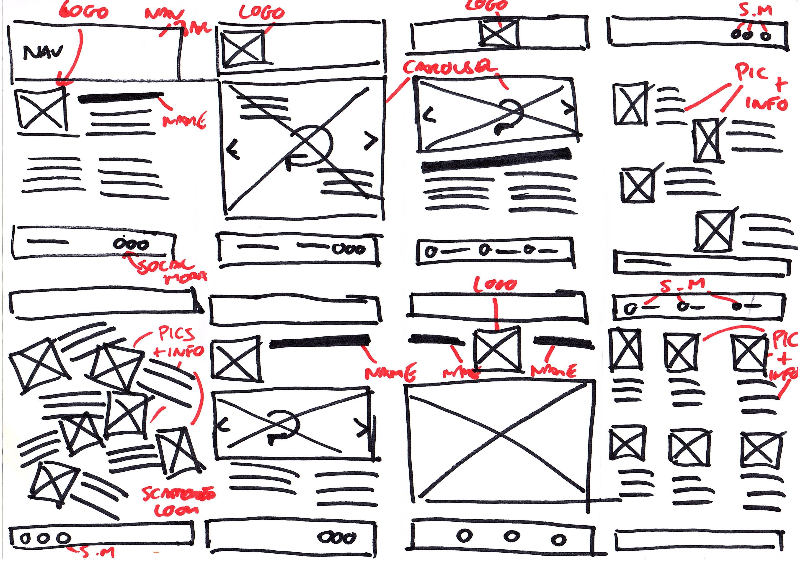
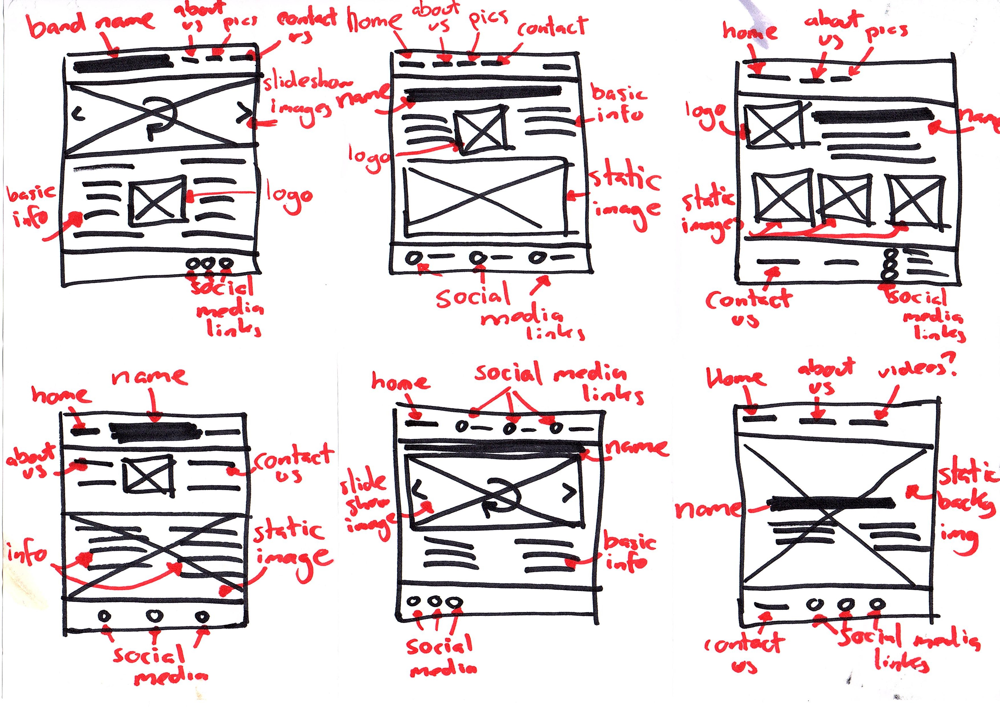
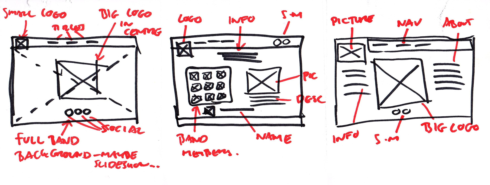

# Diddy vs The Kingdom

This project will be designed for the band that has recently formed that i am part of. We have been practicing for almost a year now, with some social media pages, but a useable website would help the band promote itself and be able to get further and have a visual internet presence. 

As The band is very new there is nothing on the page about shows or albums, but there is information about the band all together in one place for interested people to be able to get a sense of the band.

## UX

#### Wireframe Designs

## Features

### Existing Features

* **Landing Page** - This is the home page or first page users will find. It is simple, with just a background, a navbar, a large band logo and a tagline. This gives people a quick look over what the website is representing, but simple so that it gets to the point.

* **The Band** - A page to give some info about the band, let users know what the band is about and the type of music played. It then goes on to talk about the band members, giving some info about them and visuals of them.

* **Gallery** - Various methods of showcasing the band, using a slideshow with some images, then a gallery of static images and a video of the band at a rehersal. 

* **Contact Us** - Simple contact form to be able to get in contact with the band.

### Features Left to Implement

## Technologies Used

## Testing

## Deployment

## Credits

### Content
- The text for section Y was copied from the [Wikipedia article Z](https://en.wikipedia.org/wiki/Z)

### Media
- The photos used in this site were obtained from ...

### Acknowledgements

- I received inspiration for this project from X

##### Landing

Starting with a landing page type screen. This initially was going to be a home page, with a carousel of images and information about the band. This got changed to be a static landing page, with the bands name/logo in the centre of the page, a tagline, and then with a navbar at the top to go to the main parts of the site. Social media links to the bands pages.

##### The band

Similar to an about me, the band page will have a brief intro of the band along with a screen that will tell you about the members of the band. Currently this is designed a little bit like the Mario Kart selection screen.

##### Photos

-

## Frameworks

I have used some bootstrap in this for columns and rows, font awesome and font and 
