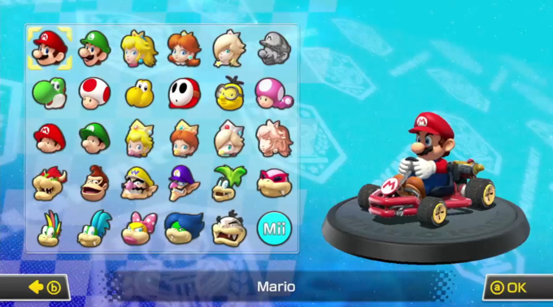
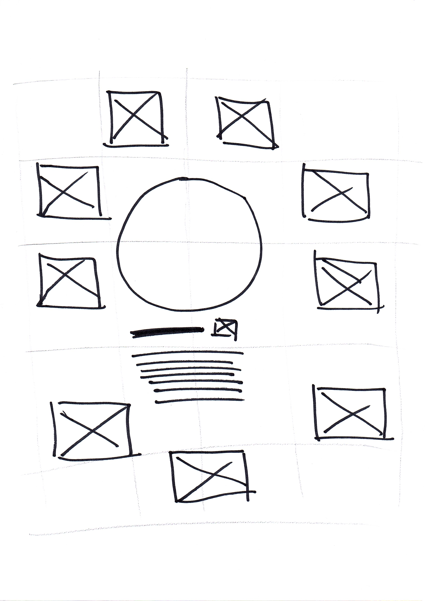
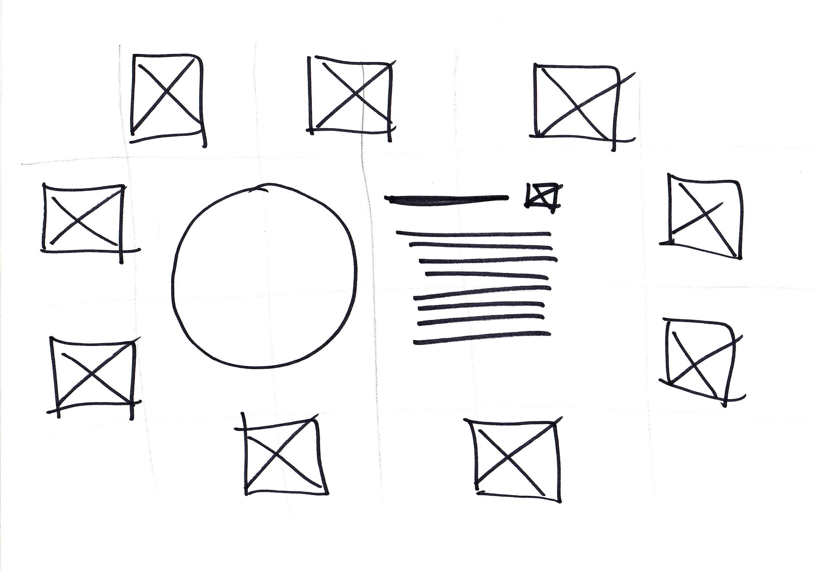

# Diddy vs The Kingdom

This project is my first milestone project for the Full Stack Web Developer Course with Code Institue. It will be designed for the band that has recently formed that i am part of. We have been practicing for almost a year now, with some social media pages, but a useable website would help the band promote itself and be able to get further and have a visual internet presence. 

As The band is very new there is nothing on the page about shows or albums, but there is information about the band all together in one place for interested people to be able to get a sense of the band. As it is controlled by myself as part of the band, it will be easy to add things and develop the website further as the band progresses. 

The band is very light hearted and as well as being passionate about music, they are passionate about gaming and the band is based around Nintendo games; Diddy Kong Racing' and 'Mario Kart', so I will be looking to try and keep the light hearted feel and relation to these games through the website. 

## **UX**

The purpose of the website is to be able to give a web page that would show up in searches for the band and a central point for information, rather than relying on social media. with this is mind i had to think about what the user would need. 

- As a user, I want to be able to read about the band, so i can tell if they are something I'm interested in.
- As a user, I want to be able to know who is in the band and what they do, to give me a sense of the lineup.
- As a user, I want to be able to hear some of the music to see if i like it. 
- As a user, If i want to talk to the band or book for a show, i want to be able to get in touch.

As part of the band, it was useful to know what we currently have and be able to talk to the other members to see what we are trying to do and what might be needed. It should be very quick and easy to determine what they want and be able to make small changes to suit needs.

#### Wireframe Designs:

I started with making a fair few wireframe designs, i could have done these using [Balsamiq](https://balsamiq.com/), and started to, but there was lots of different ideas to replicate, so I drew out a lot of different wireframe ideas and then sat with the band to determine what layouts looked good to them and what different parts were good.

While going through the design, one of the biggest parts was the band member selection. As the band is into gaming and the name is based around Diddy Kong Racing and Mario Kart, i thought that for the page telling about the band, it would work well like the character selection from Mario Kart.

The idea was great, but there were some issues with the layout, as i was only working with HTML and CSS, the ideal in my head was to click on a member and their information show. Clicking seems to be only available with JavaScript, so i had to do lots of thinking with hover and transition delays. I built this up but then you couldnt get to the links for that member without hovering over someone else, so a layout redesign had to happen.

I drew out the above two wireframes, with the information in the centre and trying to stagger 9 boxes around it, these were really helpful and let me draw the grid layout behind them to make it easy to work out how to code it. I went with the landscape design so to fit on most desktop style displays best. Once this went in, i was happy with the layout, not perfectly how i wanted it, but worked well to what the idea was. 

Being able to talk and get opinions from everyone made it easier to develop further designs and take all the features that were good, this is why there is a lot of different wireframes. There was some settling on ideas, but as the project developed from my end, some things didnt work, or werent as user friendly as possible, so i have taken the ideas and tweaked them to make things sit better.

## **Features**

### ***Existing Features***

**Navbar**
- Used across all pages, showing the available pages on the site and incorporating the band logo along with social media links.
- Allows the User to navigate Home, The Band, Gallery and a Contact Page.
- At Tablet size devices and smaller, the social links move to the footer.
- At Phone size devices the menu collapses into a slide down menu.

**Landing Page**
- Taking inspiration from a lot of other band websites, they use a landing page, which is simple and quick to see. 
- Main part of the landing page has a large band logo in the middle, with a tagline underneath, not giving the user too much info to read, just the desire to go into the site further.

**The Band** 
- Basic Information about the band, to show their origins and about them.
- Band members, with a 9 peice band this enabled this to be a large part, taking inspiration from a 'Mario Kart' character selection screen.
- On tablet and phone sized screens, this changes to a list style layout with a section per member, as the selection box wouldnt be as usable on smaller screens. 

**Gallery** 
- Showing a small slideshow or images. A slideshow was an idea liked by the band a lot.
- A set of images of the band. Set up with 3 columns on larger screens and 2 columns on smaller screens.
- A short viedo that was taken from a rehersal with sound.

**Contact Us**
- Simple contact form to be able to get in contact with the band.

**Footer**
- A small footer that takes the social media links at smaller devices and then just displays my name as website creator.

### ***Features Left to Implement***

**Upcoming Shows**
- Possible calendar with upcoming shows (currently there are none so this couldnt be made)

**Better Pictures**
- During the Virus outbreak, we havent really been able to take photos or get together to get similar layout photos, and some band members havent sent them through. Proper pictures with the same formats to give the website more continuity would be good.

**Music**
- Possibly some more music samples or updates of any recording/ music that might be coming out.

**Blog**
- A blog to update on the bands progress, what we are doing etc. This doesnt exist as of yet, and with COVID-19, not really doing anything at the moment.

## **Technologies Used**

#### [HTML (Hypertext Markup Language)](https://www.w3schools.com/html/)
- HTML is the standard markup language for programmers to use to display content on a webpage.

#### [CSS (Cascading Style Sheets)](https://www.w3schools.com/css/)
- CSS works alongside HTML to add style and effects to the website.

#### [Bootstrap](https://getbootstrap.com/)
- Bootstrap is a free, open source front end framework, that is directed at mobile first web development. It mainly contains CSS and has the option for some JavaScript. Used a little for the slideshow/carousel.

#### [Github](https://github.com/)
- A software development sharing platform used for hosting and sharing projects for open source, or team based projects. 'I was using github so other people can see, its easily hostable and can deploy easily.

#### [Gitpod](https://www.gitpod.io/)
- An IDE (Integrated Development Environment) for GitHub that lets you quickly launch your projects in a ready-to-code environment.

#### [Git](https://git-scm.com/)
- A free and open source version control system that handles all projects and keeps version history in check.

#### [Font Awesome](https://fontawesome.com/)
- A font and icon based toolkit based on CSS - Wikipedia. I used font awesome icons mainly for social media links and the small screen menu. I would have liked to add more in, like instruments, but they werent available in the free version. 

#### [Affinity Designer](https://affinity.serif.com/en-gb/designer/)
- Vector graphics design and editing software. This was used for making the logo, tried making this in CSS, but getting the affects wasnt easy so i made it here, which made it an easily responsive design across the site. 

#### [Affinity Photo](https://affinity.serif.com/en-gb/photo/)
- Raster Grahics design and editing software. Touching up and cropping photos to work in the way i wanted them to, mainly for the band selection screen, but also cropping them to fit better across the website. 

#### [Chrome Developer Tools](https://developers.google.com/web/tools/chrome-devtools)
 - A set of Web developer tools built into Google Chrome that allows you to make changes to a website on the fly for testing purposes and be able to diagnose issues. I used this for a lot of the testing, being able to turn off certain CSS features and add in new ones with none of the actual code changing. This let me try things and didnt break the source code. 

## **Testing**

As a little bit of a perfectionist, i was testing this throughout the project, making changes or adding content and seeing if they worked out how they seemed in my head. Being part of the band and being in touch with them everyday made testing much easier, able to send pictures or videos of what I'd done today and get any suggestions on it. 

At about 60-70% through the project, I used the code institute module form to see where i was and what i had to do still. From this, i ran all my code through validators. The [HTML Validator](https://validator.w3.org/) was very useful and most pages ran through with no problem. All the pages had a warning about using h2-h6 headers in a section, but i knew all my sections that needed had headers, just maybe not directly inside that section. On the Band page, i had put a paragraph element inside a span element which is not useable so i moved these around and adjusted the CSS code to match these changes.

The [CSS Pages](https://jigsaw.w3.org/css-validator/) went through mostly fine too. There was a couple of unrecognised coding parts, in the media queries, I'd used 'max-device-width', this just wanted the device taking out of it. I had put 'auto' on a line-height, but this wanted just taking out as it wasnt working and the standard line height was working fine. I tested both these again as i got towards submission time and all was working great apart from the header warnings. 

### ***User Testing***

With being a part of the band, i was able to send through videos and images as i coded to get feedback. At about 60-70% i sent a version of the site from github pages to everyone for them to run through and test the links and try it on all devices to see what was happening. A lot of the feedback was given, the first issue was the images were not showing on the deployed page. Looking into it the path for images was '../', which had worked fine all the way through, but during deployment it didnt. Changing the link to './' worked as github and gitpod seemed to look at the paths slightly differently. Most things were working fine and the users had no issues, mainly spelling errors. The main issue was with the member selection screen, at the time it was just hovering, but some 'about me' text needed to be scrolled and links could not be clicked as the info disapeared when you moved off. This was what lead to the re-looking at the screens design, (see the UX / Wireframes section), for the users to be able to see and use all the data.

Close to the end of the project i sent a link through to my family and some other friends that were not involved in the creation process to see how things responded. Again, most things were working fine and there was no issues that stopped the users navigating the site or anything that broke links. Although i had tested this across what screen sizes i could, my Dad had some issues with his laptop, (Lenova Thinkpad). I looked up the screen resolution and used the Chrome tools to simulate this, there were issues were certain elements were crossing over each other as the height to width ratio was a lot different from a desktop PC or a tablet. As i am using viewport height and widths, I adjusted these and tested the outcomes across as many screen resolutions as i could to make sure things worked properly. 

The user feedback was good, the band was impressed with the outcome as were my family. My little brother especially liked how the band selection screen worked, so hopefully this will be a good user feature.

I ran through the site a lot on my own too, thinking of every outcome and the visual display too. As i ran though a made a list of anything the didnt look right or didnt 100% work how i wanted it to and noted these down. Afterwards i worked through the list to fix all the issues, making sure to cover everything i could see. 

### ***Mentor Advice***

I am always worried and always overthinking, so my last meeting with Gerry helped, he pointed me in the right direction and what things to change and tidy up.

Main thing was answered about the contact page and if the form should send anywhere. Gerry said that it shouldnt but there should be a popup of success, so this was built in afterwards, learning and having a popup like modal display in the middle of the screen. 

I have mainly tidied things up since this meeting, tidying up any gaps in the code, combining classes, and putting an awful lot of notes in to explain the thought process of things. 

We were both very happy with the working of the site, and after all these changes, i did a last run through of all the pages and elements in all responsive sreen sizes to check it was working before i handed the project in. 

## Deployment

I have deployed this using GitHub Pages using the following process;

1. From my github account [https://github.com/mattb0101](https://github.com/mattb0101)
1. New Repository was created, [https://github.com/mattb0101/diddy_vs_thekingdom](https://github.com/mattb0101/diddy_vs_thekingdom). This was using a template from the Code Institute to build off [https://github.com/Code-Institute-Org/gitpod-full-template](https://github.com/Code-Institute-Org/gitpod-full-template).
1. To be able to view this i had to follow the following steps.
    1. From the Repository, click the setting button.
    1. Scroll down to the Github Pages Section.
    1. Change the source from 'None' to the branch to use. I have been using 'master'.
    1. Scroll back down after saving, and the link will be available. [https://mattb0101.github.io/diddy_vs_thekingdom/](https://mattb0101.github.io/diddy_vs_thekingdom/)
1. The Code can be run from Github, using Gitpod by pressing the 'Gitpod' button, or cloning, downloading and forking the code. 

## **Credits**

### ***Content***
- HTML
- CSS
- [Bootstrap](https://getbootstrap.com/docs/4.4/components/carousel/), used for the carousel/slideshow which includes some JavaScript to make the images slide.
- [Font Awesome](https://fontawesome.com/)
- [Google Fonts](https://fonts.google.com/)
- [CSS Tricks](https://css-tricks.com/) for a full teaching of the [grid system](https://css-tricks.com/snippets/css/complete-guide-grid/) as i decided to use this rather than bootstrap to be able to have full control over my layout. 
- [w3schools](https://www.w3schools.com/) for hints and tips and furthering my knowledge of attributes and elements learnt so far.
- [Navbar background](https://leaverou.github.io/css3patterns/#honeycomb)- A CSS pattern by Paul Salentiny to make a honeycomb style background. This takes inspiration from the 'Mario Kart' turtle shells. I have tweeked some of the colours but mainly a great piece of code by Paul.
- Stack Overflow for some tips on lots of things, main uses were [temporarily disabling transition affects](https://stackoverflow.com/questions/11131875/what-is-the-cleanest-way-to-disable-css-transition-effects-temporarily#:~:text=To%20restore%20the%20transition%20as,%2F%2F%20Restore%20the%20transition%20elem.), [selecting all elements except the first one](https://stackoverflow.com/questions/4013701/select-all-tr-except-the-first-one) and [moving the bootstrap carousel titles](https://stackoverflow.com/questions/30125830/how-to-move-bootstrap-3-carousel-caption-below-images).
- [Beyond Paper](https://beyond-paper.com/) this was what i used to understand [clip-path polygons](https://beyond-paper.com/clip-path-polygons-explained/).
- [Codepen](https://codepen.io/peiche/pen/vhqym) - Used this code to help build the modal/success popup when the user sends something from the contact page.

### ***Media***
- All the photos and videos used on this site were taken or sent by members of the band so are all ok to use on the page.
- The Logo was created by me using Affinity Designer, Google Fonts and the vs logo from [here](https://www.subpng.com/png-8fe1jd/download.html)

### ***Acknowledgements***

- During research i took inspiration from similar style professional bands. The main 2 that i took inspiration from were [Reel Big Fish](http://www.reel-big-fish.com/) and [Popes of Chillitown](https://popesofchillitown.com/). 
- My cousin [Chris Baum](https://github.com/cbaum86) for being the biggest help and support with this. As a web designer himself, able to look at the project, gives me hints and tips and help when one line of code isnt working properly. Teaching me things and some best practice methods, adding a little colour into things when everything was black and white to me. Chris forked this project and showed me demo's of what he was talking about, so some of the code i have borrowed from that, early grid layout and some colour work.
- My girlfriend Steph for putting up with me through all this but being really positive and supportive of my work. Obviously my cat Kyra....who decides to steal my mouse and re-write the code, but keeping me company most of the day too.
- Main shout out to the band, we cant practice at the moment and are all missing that! They let me do this, helped a lot with getting pictures and doing loads of testing for me, and put up with constant videos that my geeky self posted and was happy....that probably meant nothing to them.
- My Mum and Dad, for always supporting, asking how things were going, pushing me (even though Dad pushed a little hard sometimes...). But they've always been there and wanting me to succeed at all this and helping with anything i needed.
- Connie Higgins at learning people, for being a great support person since day one of the course, always positive and helping me push forward, always brings a smile to my face!
- Other students on this course, helping and happy to share their projects for inspiration. Definitley used them with help for the README when i didnt have a clue where to go with it!
- My mentor Gerry McBride for the support, staying calm which helped me and even through all this current worldwide mess, being really helpful and there when needed even with his own work. 